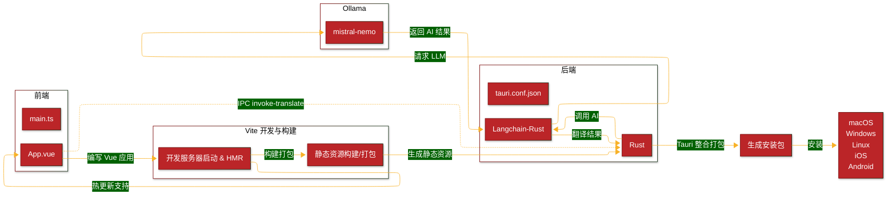

<!-- markdownlint-disable MD033 MD045 -->

# Volant App

A translate app using tauri and langchain.

## 1 App Mechanism

**WRY** is a cross-platform WebView rendering library in Rust that supports all major desktop platforms like Windows, macOS, and Linux.

Tauri uses WRY as the abstract layer responsible to determine which webview is used (and how interactions are made).

**TAO**, cross-platform application window creation library in Rust that supports all major platforms like Windows, macOS, Linux, iOS and Android. Built for you, maintained for Tauri.

Inter-Process Communication (**IPC**) allows isolated processes to communicate securely and is key to building more complex applications.




## 2 App Demo

"飞光飞光，劝尔一杯酒。吾不识青天高，黄地厚。"


## 3 App Develop

```sh
# npm install --global yarn
# yarn add -D @tauri-apps/cli@latest
yarn tauri dev
```

### App Created by `create-tauri-app`

```sh
cargo create-tauri-app
✔ Project name · volant
✔ Identifier · org.feuyeux.tauri.volant
✔ Choose which language to use for your frontend · TypeScript / JavaScript - (pnpm, yarn, npm, deno, bun)
✔ Choose your package manager · yarn
✔ Choose your UI template · Vue - (https://vuejs.org/)
✔ Choose your UI flavor · TypeScript
```

## 4 App Distribute

```sh
# src-tauri/target/release/volant.exe
yarn tauri build
```

### [Android](https://tauri.app/start/prerequisites/#android)

```sh
# rustup target add aarch64-linux-android armv7-linux-androideabi i686-linux-android x86_64-linux-android
yarn tauri android init
```

```sh
# src-tauri\gen\android\gradle\wrapper\gradle-wrapper.properties
# distributionUrl=https\://mirrors.cloud.tencent.com/gradle/gradle-8.9-bin.zip
yarn tauri android build --apk
```
